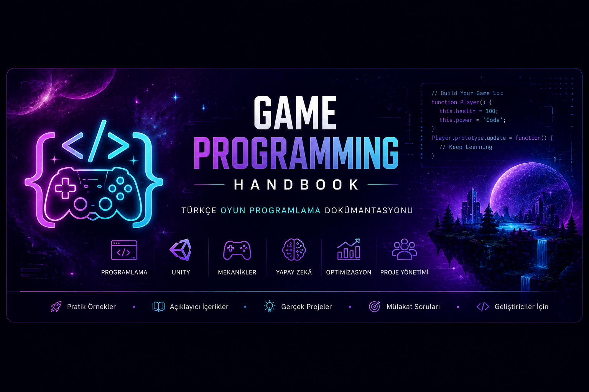

<p align="center">
  <a href="https://beyzauzun-ai.github.io/game-programming-handbook/">
    
  </a>
</p>

<h1 align="center">Game Programming Handbook</h1>

<p align="center">
  Unity, C#, oyun tasarımı, yapay zekâ, optimizasyon ve proje yönetimi konularını kapsayan kapsamlı Türkçe oyun programlama dokümantasyonu.
</p>

<p align="center">
  <a href="https://beyzauzun-ai.github.io/game-programming-handbook/">
    
  </a>
  <a href="https://github.com/beyzauzun-ai/game-programming-handbook">
    
  </a>
  <a href="https://github.com/beyzauzun-ai/game-programming-handbook/stargazers">
    
  </a>
</p>

<p align="center">
  <a href="https://github.com/beyzauzun-ai/game-programming-handbook">
    
  </a>
  <a href="https://www.mkdocs.org/">
    
  </a>
  <a href="https://unity.com/">
    
  </a>
  <a href="https://learn.microsoft.com/dotnet/csharp/">
    
  </a>
</p>

---

## 📖 Proje Hakkında

**Game Programming Handbook**, oyun geliştirme alanındaki çalışma notlarını düzenli, erişilebilir ve açık kaynaklı bir teknik dokümantasyona dönüştürmek amacıyla hazırlanmıştır.

Projenin temelini, edX üzerinde tamamladığım **From Code to Creation: Mastering Game Programming** eğitiminde edindiğim bilgiler oluşturmaktadır. Kurs içeriği; ek açıklamalar, Unity ve C# örnekleri, en iyi uygulamalar, mini çalışmalar ve mülakat sorularıyla genişletilmiştir.

Dokümantasyon, yalnızca kurs özeti sunmak yerine oyun geliştirmenin teknik, tasarımsal ve yönetimsel yönlerini bir arada ele alan Türkçe bir başvuru kaynağı olmayı hedeflemektedir.

<p align="center">
  <a href="https://beyzauzun-ai.github.io/game-programming-handbook/">
    <strong>🌐 Canlı dokümantasyonu görüntüle →</strong>
  </a>
</p>

---

## ✨ Öne Çıkan Özellikler

| | Özellik | Açıklama |
|---|---|---|
| 🇹🇷 | **Türkçe içerik** | Temel kavramlar anlaşılır Türkçe açıklamalarla sunulur. |
| 📚 | **20 kapsamlı bölüm** | Oyun endüstrisinden bütçe yönetimine kadar uçtan uca içerik içerir. |
| 💻 | **Kod örnekleri** | Unity ve C# konuları uygulamalı örneklerle desteklenir. |
| 🧪 | **Unity Lab çalışmaları** | Bölümlerin sonunda bilgiyi pekiştiren küçük uygulamalar bulunur. |
| 💼 | **Mülakat hazırlığı** | Unity ve oyun geliştirme alanında sık sorulan sorular bir araya getirilmiştir. |
| 📖 | **Terimler sözlüğü** | Teknik terimlerin Türkçe açıklamaları ve İngilizce karşılıkları bulunur. |
| 🔍 | **Gelişmiş arama** | MkDocs Material aramasıyla içeriklere hızlıca ulaşılabilir. |
| 🌙 | **Açık ve koyu tema** | Kullanıcı tercihine göre tema değiştirilebilir. |
| 📱 | **Mobil uyumlu** | Dokümantasyon telefon, tablet ve masaüstünde kullanılabilir. |
| 🚀 | **GitHub Pages** | Proje ücretsiz ve herkese açık bir web sitesi olarak yayınlanır. |

---

## 🗺️ İçerik Haritası

<table>
  <tr>
    <td width="50%" valign="top">

### 🎮 Temeller

1. Oyun Endüstrisi  
2. Oyun Geliştirme Süreci  
3. Programlama Temelleri  
4. Oyun Motorları  
5. Oyun Mekanikleri  
6. Kontrol Akışı ve OOP  

### ⚙️ Unity

7. Unity Temelleri  
8. Nesneler ve Veri Yönetimi  
9. Fizik ve Çarpışmalar  
10. Oyuncu Sistemleri  
11. Oyun Sistemleri  

</td>
<td width="50%" valign="top">

### 🎨 Tasarım ve Üretim

12. Oyun Yapay Zekâsı  
13. Oyun Varlıkları  
14. Animasyon  
15. Animasyon Entegrasyonu  

### 🚀 Optimizasyon ve Yönetim

16. Performans Optimizasyonu  
17. Programlama Uygulamaları  
18. Proje Yönetimi  
19. Oyun Üretimi  
20. Bütçe Yönetimi  

### 📚 Ek Bölümler

- Oyun Geliştirme Terimleri Sözlüğü  
- Oyun Geliştirme Mülakat Soruları  

</td>
  </tr>
</table>

---

## 🧠 Her Bölümde Neler Var?

Dokümantasyon bölümleri konuya göre aşağıdaki içeriklerle desteklenmektedir:

- 📖 Kavram açıklamaları
- 🎯 Öğrenme hedefleri
- 💻 Unity ve C# örnekleri
- ✅ En iyi uygulamalar
- ⚠️ Yaygın hatalar
- 🧪 Mini uygulamalar ve Unity Lab görevleri
- 💼 Mülakat soruları
- 📚 Ek kaynak önerileri

---

## 🛠️ Kullanılan Teknolojiler

<p align="center">
  
</p>

| Teknoloji | Kullanım amacı |
|---|---|
| **Unity** | Oyun geliştirme kavramları ve uygulama örnekleri |
| **C#** | Oyun mantığı ve Unity betikleri |
| **Markdown** | Dokümantasyon içeriğinin hazırlanması |
| **MkDocs Material** | Dokümantasyon sitesinin oluşturulması |
| **Git & GitHub** | Sürüm kontrolü ve açık kaynak paylaşımı |
| **GitHub Pages** | Dokümantasyon sitesinin yayınlanması |
| **Visual Studio Code** | İçerik ve yapılandırma dosyalarının düzenlenmesi |

---

## 🚀 Projeyi Yerel Ortamda Çalıştırma

### 1. Repoyu klonlayın

```bash
git clone https://github.com/beyzauzun-ai/game-programming-handbook.git
```

### 2. Proje klasörüne geçin

```bash
cd game-programming-handbook
```

### 3. Gerekli paketi yükleyin

```bash
pip install mkdocs-material
```

### 4. Yerel sunucuyu başlatın

```bash
mkdocs serve
```

### 5. Tarayıcıda açın

```text
http://127.0.0.1:8000/game-programming-handbook/
```

---

## 📁 Proje Yapısı

```text
game-programming-handbook/
│
├── docs/
│   ├── assets/
│   │   └── images/
│   │       ├── banner.png
│   │       ├── logo.png
│   │       └── favicon.png
│   │
│   ├── index.md
│   ├── game-industry.md
│   ├── development-pipeline.md
│   ├── programming-fundamentals.md
│   ├── game-engines.md
│   ├── game-mechanics.md
│   ├── control-flow-and-oop.md
│   ├── unity-fundamentals.md
│   ├── objects-and-data.md
│   ├── physics-and-collisions.md
│   ├── player-systems.md
│   ├── game-systems.md
│   ├── game-ai.md
│   ├── game-assets.md
│   ├── animation.md
│   ├── animation-integration.md
│   ├── performance-optimization.md
│   ├── programming-practices.md
│   ├── project-management.md
│   ├── game-production.md
│   ├── budget-management.md
│   ├── glossary.md
│   └── interview-questions.md
│
├── mkdocs.yml
└── README.md
```

---

## 🎯 Projenin Amaçları

- Oyun geliştirme ve Unity bilgilerimi yapılandırmak
- Teknik dokümantasyon becerilerimi geliştirmek
- Öğrenme sürecimi düzenli olarak belgelemek
- Türkçe oyun programlama kaynaklarına katkıda bulunmak
- Açık kaynak proje geliştirme deneyimi kazanmak
- Öğrenciler ve yeni başlayanlar için erişilebilir bir başvuru kaynağı oluşturmak

---

## 🧭 Gelecek Planları

- [x] Yirmi ana bölümün hazırlanması
- [x] Terimler sözlüğünün eklenmesi
- [x] Mülakat sorularının Türkçeleştirilmesi
- [x] MkDocs Material altyapısının kurulması
- [x] GitHub Pages üzerinde yayınlanması
- [x] Özel logo, favicon ve README banner tasarımı
- [ ] Unity ekran görüntülerinin eklenmesi
- [ ] Daha fazla uygulamalı C# örneğinin hazırlanması
- [ ] Mermaid diyagramlarının eklenmesi
- [ ] Mini Unity projelerinin dokümantasyona bağlanması
- [ ] İngilizce içerik seçeneğinin hazırlanması

---

## 🤝 Katkıda Bulunma

Projeye katkı sunmak için:

1. Repoyu fork edin.
2. Yeni bir branch oluşturun.

```bash
git checkout -b feature/yeni-icerik
```

3. Değişikliklerinizi kaydedin.

```bash
git commit -m "Yeni içerik ekle"
```

4. Branch’inizi gönderin.

```bash
git push origin feature/yeni-icerik
```

5. Bir Pull Request açın.

Hata bildirimleri, düzeltmeler ve yeni içerik önerileri memnuniyetle karşılanır.

---

## 👩‍💻 Proje Sahibi

**Beyza Uzun**

Software Developer | MSc | Unity Learner | AI & Cybersecurity Enthusiast

<p>
  <a href="https://github.com/beyzauzun-ai">
    
  </a>
  <a href="https://www.linkedin.com/in/beyza-uzun-1520672b5">
    
  </a>
</p>

---

## ⭐ Projeyi Destekleyin

Bu dokümantasyonu faydalı bulduysanız repoya yıldız vererek projeyi destekleyebilirsiniz.

<p align="center">
  <a href="https://github.com/beyzauzun-ai/game-programming-handbook">
    
  </a>
</p>

<p align="center">
  <strong>Code • Create • Play</strong>
</p>

<p align="center">
  © 2026 Beyza Uzun
</p>


