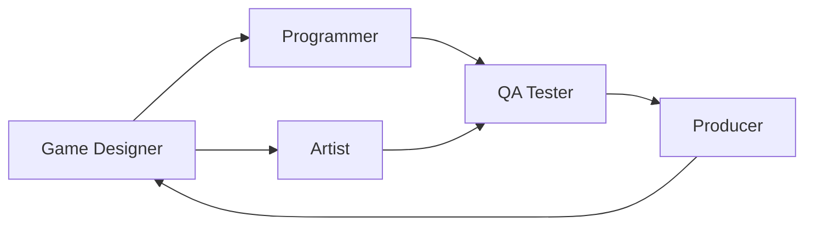

# 🎮 Oyun Endüstrisine Giriş

Bu bölümde oyun geliştirme sektöründeki temel roller, oyun türleri, yayıncılık, test süreçleri ve sık kullanılan temel kavramlar ele alınmaktadır.

---

## 🎯 Öğrenme Hedefleri

Bu bölümü tamamladığında:

- Oyun tasarımcısının temel görevlerini açıklayabilir,
- Yayıncı ile geliştirici arasındaki farkı anlayabilir,
- Oyun testinin amacını tanımlayabilir,
- Bağımsız oyun kavramını açıklayabilir,
- Oyun türlerini birbirinden ayırabilir,
- Mikroişlem ve FPS kavramlarını tanımlayabilir,
- Temel oyun geliştirme rollerini tanıyabilirsin.

---

## 🎮 Oyun Tasarımcısı

Bir **oyun tasarımcısının** temel görevi, oyunun nasıl oynanacağını ve oyuncuya nasıl bir deneyim sunacağını planlamaktır.

Başlıca sorumlulukları:

- Oynanış mekaniklerini oluşturmak,
- Oyunun kurallarını belirlemek,
- Seviye yapılarını planlamak,
- Oyuncu deneyimini geliştirmek,
- Oyunun dengeli ve eğlenceli olmasını sağlamak.

!!! note "Önemli"

    Oyun tasarımcısı her zaman kod yazmak zorunda değildir.  
    Temel görevi oyunun oynanışını ve oyuncu deneyimini tasarlamaktır.

---

## 💰 Yayıncı

**Yayıncı**, oyunun geliştirilmesini, pazarlanmasını ve dağıtılmasını destekleyen kuruluştur.

Başlıca görevleri:

- Geliştirme sürecine finansman sağlamak,
- Pazarlama kampanyalarını yürütmek,
- Reklam ve tanıtım çalışmalarını planlamak,
- Oyunun mağazalarda yayımlanmasını sağlamak,
- Dağıtım sürecini yönetmek.

```text
Publisher = Finansman + Pazarlama + Dağıtım
```

Yayıncı ile geliştirme stüdyosu aynı yapı olmak zorunda değildir.

---

## 🧪 Oyun Testi

Oyun testi yalnızca hata bulmaktan ibaret değildir.

Test sürecinin amaçları:

- Yazılım hatalarını belirlemek,
- Performansı ölçmek,
- Oynanış dengesini değerlendirmek,
- Kullanıcı deneyimini incelemek,
- Geliştirme ekibine geri bildirim sağlamak.

Kaliteli bir test süreci, oyunun kararlılığını ve oynanabilirliğini artırır.

### Test sürecinde incelenebilecek alanlar

| Alan | Kontrol edilenler |
|---|---|
| İşlevsellik | Özelliklerin doğru çalışması |
| Performans | FPS, yükleme süresi ve kaynak kullanımı |
| Oynanış | Zorluk ve denge |
| Görsel kalite | Grafik ve animasyon hataları |
| Ses | Eksik veya yanlış sesler |
| Kullanıcı deneyimi | Oyuncunun sistemi kolay anlayabilmesi |

---

## 🌟 Bağımsız Oyun

**Bağımsız oyun**, büyük bir yayıncının finansal veya kurumsal desteği olmadan geliştirilen oyundur.

Bağımsız oyunlar genellikle:

- Küçük ekipler tarafından geliştirilir,
- Tek bir geliştirici tarafından hazırlanabilir,
- Daha deneysel ve yaratıcı fikirler içerebilir,
- Daha sınırlı bütçelerle üretilir.

Bağımsız oyun kavramı, oyunun kalitesinden çok geliştirme ve yayınlama biçimini ifade eder.

---

## 🕹️ Oyun Türleri

Oyunlar, temel oynanış özelliklerine göre farklı türlere ayrılır.

Yaygın oyun türleri:

- **RPG:** Rol yapma oyunu
- **FPS:** Birinci şahıs nişancı
- **RTS:** Gerçek zamanlı strateji
- **MOBA:** Çok oyunculu çevrim içi savaş arenası
- **Platform:** Zıplama ve engel aşma odaklı oyun
- **Puzzle:** Bulmaca oyunu
- **Simulation:** Simülasyon oyunu
- **Racing:** Yarış oyunu
- **Survival:** Hayatta kalma oyunu
- **Sandbox:** Serbest oynanış sunan oyun

### RPG

**Role-Playing Game**, oyuncunun bir karakteri yönettiği, geliştirdiği ve genellikle hikâye boyunca kararlar verdiği oyun türüdür.

RPG oyunlarında sıklıkla:

- Karakter gelişimi,
- Deneyim puanı,
- Ekipman sistemi,
- Görevler,
- Diyalog seçimleri

bulunur.

---

## 💳 Mikroişlemler

**Mikroişlem**, oyuncuların oyun içinde gerçek para karşılığında küçük içerikler veya avantajlar satın almasını sağlayan gelir modelidir.

Satın alınabilecek içeriklere örnekler:

- Kostümler,
- Silah görünümleri,
- Oyun içi para,
- Karakterler,
- Sezon biletleri,
- Ek içerikler.

!!! warning "Tasarım Dengesi"

    Mikroişlemler oyuncuya avantaj sağladığında oyunun adalet ve denge algısını etkileyebilir.  
    Bu nedenle oyun ekonomisiyle dikkatli biçimde bütünleştirilmelidir.

---

## 🎥 FPS

Oyun bağlamında **FPS**, saniyedeki kare sayısını ifade eder.

```text
FPS = Frames Per Second
```

FPS değeri yükseldikçe görüntü genellikle daha akıcı görünür.

| FPS değeri | Genel değerlendirme |
|---:|---|
| 30 FPS | Oynanabilir |
| 60 FPS | Akıcı |
| 120 FPS | Çok akıcı |
| 144 FPS ve üzeri | Rekabetçi oyunlarda tercih edilebilir |

!!! info "Aynı kısaltma, farklı anlam"

    FPS aynı zamanda **First-Person Shooter** anlamına da gelebilir.  
    Kullanıldığı bağlama göre anlamı belirlenmelidir.

---

## 👨‍💻 Oyun Geliştirme Rolleri

Oyun geliştirme sürecinde farklı uzmanlık alanları birlikte çalışır.

| Rol | Temel sorumluluk |
|---|---|
| Game Designer | Oynanış sistemlerini tasarlar |
| Gameplay Programmer | Oyun mekaniklerini kodlar |
| Graphics Programmer | Grafik ve render sistemleri üzerinde çalışır |
| AI Programmer | NPC ve yapay zekâ davranışlarını geliştirir |
| UI/UX Designer | Arayüz ve kullanıcı deneyimini tasarlar |
| Level Designer | Seviyeleri ve oyun alanlarını oluşturur |
| Character Artist | Karakter varlıklarını üretir |
| Environment Artist | Çevre ve dünya tasarımını hazırlar |
| Animator | Karakter ve nesne animasyonlarını oluşturur |
| Sound Designer | Ses efektleri ve işitsel deneyimi tasarlar |
| Technical Artist | Sanat ve programlama ekipleri arasında çalışır |
| QA Tester | Oyunu test eder ve hataları raporlar |
| Producer | Proje sürecini ve ekip koordinasyonunu yönetir |

!!! note "Hata Ayıklama"

    **Game Debugger** genellikle bağımsız bir meslek adı değildir.  
    Hata ayıklama, programcıların ve test ekiplerinin yürüttüğü geliştirme faaliyetlerinden biridir.

---

## 🔗 Roller Arasındaki İş Birliği

Bir oyunun ortaya çıkması için ekipler arasında sürekli iletişim gerekir.



Oyun tasarımcısı mekanikleri planlar, programcı bunları uygular, sanat ekibi görsel varlıkları üretir, QA ekibi oyunu test eder ve yapımcı süreci koordine eder.

---

## 📌 Hızlı Tekrar

- **Game Designer:** Oynanışı ve oyuncu deneyimini tasarlar.
- **Publisher:** Finansman, pazarlama ve dağıtımı yönetir.
- **Game Testing:** Kaliteyi artırmak için geri bildirim sağlar.
- **Indie Game:** Büyük yayıncı desteği olmadan geliştirilen oyun.
- **RPG:** Rol yapma oyunu.
- **Microtransactions:** Oyun içi satın alma sistemi.
- **FPS:** Saniyedeki kare sayısı veya birinci şahıs nişancı türü.
- **Debugging:** Geliştirme sürecinde hataları bulma ve düzeltme işlemidir.

---

## 🎓 Mülakat Soruları

??? question "Oyun tasarımcısının temel görevi nedir?"

    Oyunun oynanış mekaniklerini, kurallarını ve oyuncu deneyimini tasarlamaktır.

??? question "Yayıncı ile geliştirici arasındaki fark nedir?"

    Geliştirici oyunu üretir. Yayıncı ise finansman, pazarlama, dağıtım ve yayınlama süreçlerini destekler veya yönetir.

??? question "Oyun testi neden yalnızca hata bulmak değildir?"

    Çünkü test süreci performans, oynanış dengesi, kullanılabilirlik ve oyuncu deneyimi gibi alanları da değerlendirir.

??? question "Bağımsız oyun ne anlama gelir?"

    Büyük bir yayıncının desteği olmadan bireysel geliştirici veya küçük ekip tarafından geliştirilen ve yayımlanan oyundur.

??? question "FPS kısaltmasının iki farklı anlamı nedir?"

    Frames Per Second ve First-Person Shooter.

---

## 📝 Bölüm Özeti

Bu bölümde oyun endüstrisinin temel bileşenleri incelendi. Oyun tasarımcısı, yayıncı, test uzmanı ve programcı gibi rollerin birbirini tamamladığı görüldü. Ayrıca bağımsız oyunlar, oyun türleri, mikroişlemler ve FPS gibi temel kavramlar ele alındı.

Bir oyunun başarıyla geliştirilebilmesi için yalnızca programlama değil; tasarım, sanat, test, üretim ve yayınlama ekiplerinin koordineli biçimde çalışması gerekir.
